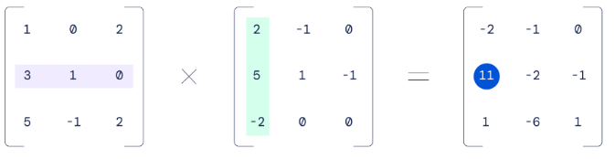
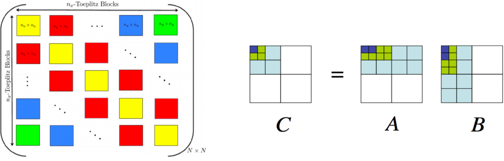
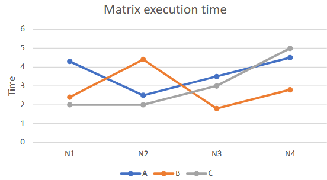
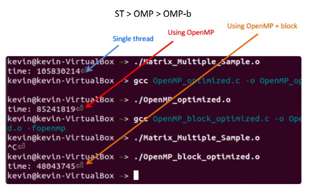
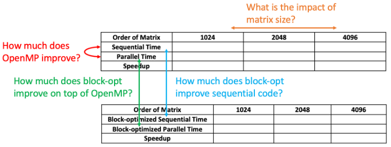

# OpenMP



## Background  

Matrix multiplication, despite being a fundamentally simple mathematical operation, reveals remarkable depth and complexity when optimized for high-performance computing. In modern computer design, especially in the context of AI and scientific computing, accelerating matrix multiplication has become a central focus.
<br>

For instance, NVIDIA’s recent GPU architectures exemplify this trend. Many of the most significant advancements in chipslike the H100 and B200 are specifically engineered to enhance matrix multiplication throughput:<br>

    + Tensor Cores: Specialized co-processors designed exclusively for matrix operations, now capable of handling larger tile sizes than previous generations.
    + Tensor Memory: A newly introduced cache optimized for storing intermediate results
    from tensor core computations.
    + Tensor Memory Accelerator (TMA): Hardware introduced in the H100 to facilitate asynchronous memory movement tailored for tensor operations.

These hardware innovations are complemented by increasingly sophisticated software stacks and abstractions, which are essential to orchestrate and fully utilize the underlying capabilities. Together, they illustrate how a seemingly straightforward operation like matrix multiplication can drive architectural innovation and software complexity at scale.  

The following code implements multiplication of two matrices. The order of the matrix is 2048. Function matrixInit() initializes a double type value for all elements in the matrix. Function matrixMulti() performs the multipy calculation. However, the program executes in the sequential implementation.<br>
<https://github.com/kevinsuo/CS4504/blob/master/Matrix_Multiple_Sample.c>

```C
# include <stdio.h>
# include <omp.h>
# include <time.h>
# include <stdlib.h>

# define N 2048
# define FactorIntToDouble 1.1;

double firstMatrix [N] [N] = {0.0};
double secondMatrix [N] [N] = {0.0};
double matrixMultiResult [N] [N] = {0.0};

void matrixMulti() {
    for(int row = 0 ; row < N ; row++){
        for(int col = 0; col < N ; col++){
            double resultValue = 0;
            for(int transNumber = 0 ; transNumber < N ; transNumber++) {
                resultValue += firstMatrix [row] [transNumber] * secondMatrix [transNumber] [col] ;
            }
            matrixMultiResult [row] [col] = resultValue;
        }
    }
}

void matrixInit() {
    for(int row = 0 ; row < N ; row++ ) {
        for(int col = 0 ; col < N ;col++){
            srand(row+col);
            firstMatrix [row] [col] = ( rand() % 10 ) * FactorIntToDouble;
            secondMatrix [row] [col] = ( rand() % 10 ) * FactorIntToDouble;
        }
    }
}

int main() {
    matrixInit();
    clock_t t1 = clock();
    matrixMulti();
    clock_t t2 = clock();
    printf("time: %ld", t2-t1);
    //double t1 = omp_get_wtime();
    //matrixMulti();
    //double t2 = omp_get_wtime();
    //printf("serial time: %3f\n", ((double)t2 - t1) / CLOCKS_PER_SEC* 1000000.0);
    return 0;
}
```

**Note: You have two ways to measure the execution time.**

    1. clock() records the number of ticks of the CPU. When multiple processes are calculated simultaneously in parallel, the number of CPU ticks increases multiplied. You should divide the clock() by N if you use N processes.
    2. omp_get_wtime() returns the timestamp, which is irrelevant to the number of processes.

## Task 1 (50 points)

Write a parallel program using OpenMP based on this sequential solution to accelerate it.

To compile the program with OpenMP, use:

```bash
gcc program.c -o program.o -fopenmp
```  

Please write a one-page report (with number and figures), which compares the execution time of sequential solution and parallel solution under different matrix orders (value of N). To get stable values, try to get the average time for each execution. 

| Order of Matrix | 1024 | 2048 | 4096 |
|-----------------|------|------|------|
|Sequential Time| | | |
|Parallel Time| | | |
|Speedup| | | |

## Task 2 (50 points)

In order to further improve the performance, the matrix can be divided into blocks, and a part of the matrix can be calculated at one time. Under such the implementation, the CPU can move a part of the matrix data into the cache, which can improve the cache hit rate and the program performance.



Please write a block-optimized matrix multiplication program and use OpenMP to parallel its execution. Compare the program execution time with that in Task 1 and write another report with data and figures. To get stable values, try to get the average time for each execution.  

You can use the following template:
<https://github.com/kevinsuo/CS4504/blob/main/OpenMP_block_optimized_template.c>

| Order of Matrix | 1024 | 2048 | 4096 |
|-----------------|------|------|------|
|Block-optimized Sequential Time| | | |
|Block-optimized Parallel Time| | | |
|Speedup| | | |



### Expected Output

Normally, for a certain size of the matrix, the execution time of a single-thread program (ST), OpenMP-optimized program (OMP), and OpenMP with block-optimized program (OMP-b) should be:



### Reference

When you compare the results in above Task 1 and Task 2, here are some aspects you can compare and analyze:


